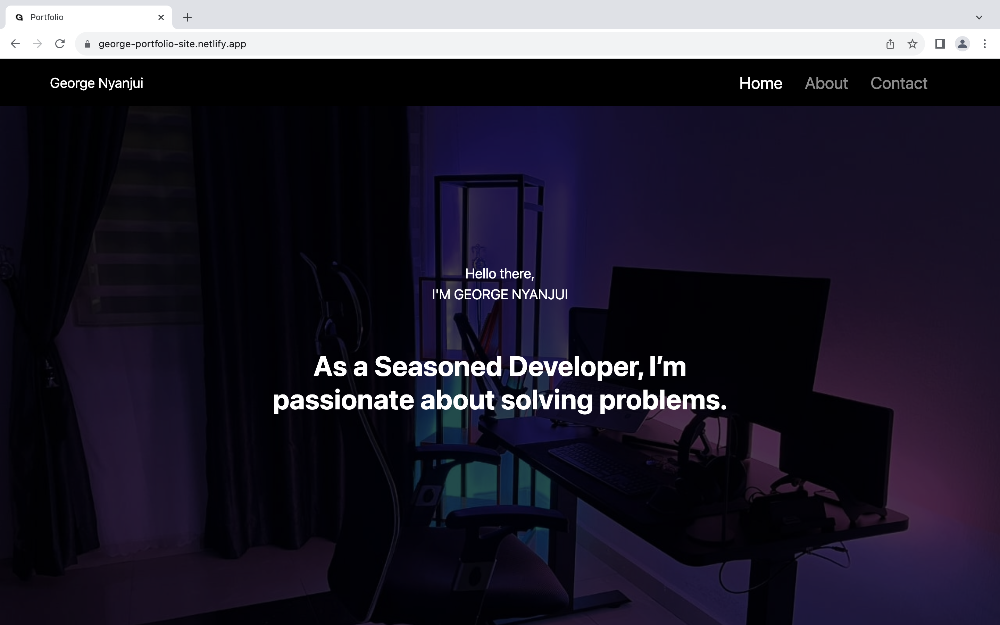

  <h2 align="center">George - Portfolio Website</h2>

  A fully responsive personal portfolio website, Responsive for all devices, built using React, CSS, Bootstrap and JavaScript. The site displays my web presence, story, work experience, education, projects, achievements, and contact information

  <a href="https://george-portfolio-site.netlify.app/"><strong>➥ Live Demo</strong></a>

 

### Demo Screeshots

### Prerequisites

Before you begin, ensure you have met the following requirements:

* [Git](https://git-scm.com/downloads "Download Git") must be installed on your operating system.

### License

This project is **free to use** and does not contains any license.

# React + Vite

This template provides a minimal setup to get React working in Vite with HMR and some ESLint rules.

Currently, two official plugins are available:

- [@vitejs/plugin-react](https://github.com/vitejs/vite-plugin-react/blob/main/packages/plugin-react/README.md) uses [Babel](https://babeljs.io/) for Fast Refresh
- [@vitejs/plugin-react-swc](https://github.com/vitejs/vite-plugin-react-swc) uses [SWC](https://swc.rs/) for Fast Refresh
